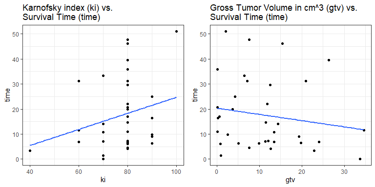

Brain Cancer Survival Analysis
================
Alec Becker

2021-11-27

### Introduction

This analysis uses the `BrainCancer` dataset from the `ISLR2` R package
to perform survival analysis. The outcome of interest is risk of death
over time after receiving a brain cancer diagnosis.

*Note: The ISLR2 package is available on CRAN:
<https://CRAN.R-project.org/package=ISLR2>*

### Set up and data import

First, we load the packages and data that will be used.

``` r
# Load libraries
library(ISLR2)
library(tidyverse)
library(survival)
library(survminer)
library(missForest)

# Call and rename dataset from ISLR2 package
data(BrainCancer)
df <- BrainCancer
```

Next, we examine the structure of the data using the `str()` function
and get a glimpse of the first few rows using the `head()` function.

``` r
str(df)
```

    ## 'data.frame':    88 obs. of  8 variables:
    ##  $ sex      : Factor w/ 2 levels "Female","Male": 1 2 1 1 2 1 2 2 1 2 ...
    ##  $ diagnosis: Factor w/ 4 levels "Meningioma","LG glioma",..: 1 3 1 2 3 1 1 2 1 3 ...
    ##  $ loc      : Factor w/ 2 levels "Infratentorial",..: 1 2 1 2 2 2 2 2 2 2 ...
    ##  $ ki       : int  90 90 70 80 90 80 80 80 70 100 ...
    ##  $ gtv      : num  6.11 19.35 7.95 7.61 5.06 ...
    ##  $ stereo   : Factor w/ 2 levels "SRS","SRT": 1 2 1 2 2 1 2 2 2 2 ...
    ##  $ status   : int  0 1 0 1 1 0 0 0 0 0 ...
    ##  $ time     : num  57.64 8.98 26.46 47.8 6.3 ...

``` r
head(df)
```

    ##      sex  diagnosis            loc ki   gtv stereo status  time
    ## 1 Female Meningioma Infratentorial 90  6.11    SRS      0 57.64
    ## 2   Male  HG glioma Supratentorial 90 19.35    SRT      1  8.98
    ## 3 Female Meningioma Infratentorial 70  7.95    SRS      0 26.46
    ## 4 Female  LG glioma Supratentorial 80  7.61    SRT      1 47.80
    ## 5   Male  HG glioma Supratentorial 90  5.06    SRT      1  6.30
    ## 6 Female Meningioma Supratentorial 80  4.82    SRS      0 52.75

From the `str()` output, we see the dataset contains 88 observations and
8 variables. The `head()` output helps us understand the data by showing
the column names and some example rows.

### Data preparation

To check for missingness, we apply an anonymous function to obtain the
total number of missing values in each column. `sapply()` handles
applying the function to each column and returning the output in the
simplest form possible – in this case, a vector.

``` r
sapply(df, function(x) sum(is.na(x)))
```

    ##       sex diagnosis       loc        ki       gtv    stereo    status      time 
    ##         0         1         0         0         0         0         0         0

We see the dataset’s only missing value is in the `diagnosis` variable.
We would likely be safe dropping this observation and proceeding with
the 87 complete rows. It is unlikely that excluding one observation
would introduce much bias in the analysis.

However, we want to retain every observation possible because we are
working with a small dataset. We want to maximize statistical power as
well as the amount of data available to train and test a model. To keep
this observation, we impute the missing value using a [random
forest](https://link.springer.com/article/10.1007/s11749-016-0481-7)
model. We use the `missForest` package to fit and evaluate a model, use
that model to impute the missing value, then save the newly complete
dataset in the `df_imputed` object.

``` r
set.seed(1) # We set a random seed for reproducibility because there is randomness in the random forest algorithm
rf_imputation <- missForest::missForest(df)
```

``` r
rf_imputation$OOBerror
```

    ##     NRMSE       PFC 
    ## 0.0000000 0.1149425

``` r
df_imputed <- rf_imputation$ximp
```

The `OOBerror` ([out-of-bag
error](https://scikit-learn.org/stable/auto_examples/ensemble/plot_ensemble_oob.html))
of the model was a percent falsely classified (PFC) of about 11%. The
reported normalized [root mean squared
error](https://www.sciencedirect.com/topics/engineering/root-mean-squared-error)
(NRMSE) is not relevant in our case because the only variable with
missing values, `diagnosis`, was nominal. The PFC of 11% tells us the
model was about 89% accurate at predicting nominal variables. Given this
relatively high accuracy, we trust the imputation of the missing
`diagnosis` value to most likely match the truth and proceed in the
analysis as if it was the true value.

### Exploratory data analysis

We now examine the complete dataset’s summary statistics using the
`summary()` function.

``` r
# Variable summary statistics
summary(df_imputed)
```

    ##      sex          diagnosis              loc           ki        
    ##  Female:45   Meningioma:43   Infratentorial:19   Min.   : 40.00  
    ##  Male  :43   LG glioma : 9   Supratentorial:69   1st Qu.: 80.00  
    ##              HG glioma :22                       Median : 80.00  
    ##              Other     :14                       Mean   : 81.02  
    ##                                                  3rd Qu.: 90.00  
    ##                                                  Max.   :100.00  
    ##       gtv         stereo       status            time      
    ##  Min.   : 0.010   SRS:23   Min.   :0.0000   Min.   : 0.07  
    ##  1st Qu.: 2.500   SRT:65   1st Qu.:0.0000   1st Qu.:10.39  
    ##  Median : 6.510            Median :0.0000   Median :24.03  
    ##  Mean   : 8.661            Mean   :0.3977   Mean   :27.46  
    ##  3rd Qu.:12.100            3rd Qu.:1.0000   3rd Qu.:41.60  
    ##  Max.   :34.640            Max.   :1.0000   Max.   :82.56

The ouput show us that:

-   The modal `sex` (binary biological sex of the observation) was
    female (45/88, or 51%).
-   The modal `diagnosis` (type of brain cancer diagnosis received) was
    [meningioma](https://braintumor.org/brain-tumor-information/brain-tumor-glossary/?gclid=Cj0KCQiAhf2MBhDNARIsAKXU5GQaT6n9tusZiDQszt64wEeQ2oPlOVWVK6-QLsSn9-8aKaR8jCB3WOUaAhHlEALw_wcB)
    (43/88, or 49%).
-   The modal `loc` (location of the tumor within the brain) was
    [supratentorial](https://www.ncbi.nlm.nih.gov/books/NBK65903/figure/CDR0000574573__205/)
    (69/88, or 78%).
-   The mean and median of `ki` ([Karnofsky
    index](https://www.sciencedirect.com/topics/medicine-and-dentistry/karnofsky-performance-status))
    was about 81 and 80, respectively. The closeness of the mean and
    median suggests the distribution is likely symmetric.
-   The mean and median of `gtv` (gross tumor volume, in cubic
    centimeters) was about 9 and 7, respectively. The larger mean in
    comparison with the median suggests the distribution may have right
    skew.
-   The modal `stereo` (type of [stereotactic
    radiation](http://www.theangelesclinic.org/Home/PatientEducationLibrary/tabid/19283/ctl/View/mid/35200/Default.aspx?ContentPubID=426#:~:text=SRS%20involves%20a%20single%20radiation,performed%20on%20an%20outpatient%20basis.)
    received) was SRT (65/88, or 74%).
-   As shown by the mean of `status` (binary indicator for patient death
    by end of study period), about 40% of the observations were known to
    have died during the study period. The remaining 60% were
    **censored**, meaning they either dropped out before the study
    period ended and could no longer be observed or were known to be
    alive at the end of the study period.
-   The mean and median of `time` (survival/observation time) was about
    27 and 24 months, respectively. There may be slight right skew in
    this variable’s distribution.

To explore how survival probability changed over time, we fit and plot a
Kaplan-Meier curve using the `survival` and `survminer` packages. This
method accounts for the censoring present in the data (indicated by
`status` = 0). Censored observations require special handling because
their survival time is unknown.

``` r
# Fit and plot a Kaplan-Meier curve for the full training sample
surv_fit1 <- survival::survfit(survival::Surv(time, status) ~ 1, data = df_imputed)
survminer::ggsurvplot(surv_fit1, data = df_imputed, surv.median.line = "h", risk.table = TRUE, ggtheme = theme_bw())
```


The above plot shows the sample’s median survival time, or the time
point at which survival probability reached 50%, was a bit under 50
months post-diagnosis. From there, survival probability marginally
decreased and then plateaued at longer durations.

While informative, we really want to understand how the explanatory
variables may have impacted survival probability. To do that, we fit a
Kaplan-Meier curve for each of the categorical predictors (i.e., `sex`,
`diagnosis`, `loc`, and `stereo`.) We fit plots for the continuous
variables in a later step.

``` r
# Define a vector of the factor variables in the dataset
cat_vars <- c("sex", "diagnosis", "loc", "stereo")

# Create a list of Kaplan-Meier plots for each factor variable
surv_plots <- lapply(cat_vars, function(x) {
  formula <- as.formula(paste0("survival::Surv(time, status) ~ ", x))
  surv_fit <- survminer::surv_fit(formula, data = df_imputed)
  survplot <- ggsurvplot(surv_fit, data = df_imputed, pval = TRUE, surv.median.line = "h", risk.table = TRUE, ggtheme = theme_bw()) +
               guides(color = guide_legend(nrow = 2))
})

# Arrange the Kaplan-Meier plots on a 2 x 2 grid
survminer::arrange_ggsurvplots(surv_plots, ncol = 2, nrow = 2)
```


From the plots above, we see that `diagnosis` (type of brain cancer
diagnosis) and `stereo` (type of stereotactic radiation received) had
statistically significant relationships with survival at the 95%
confidence level. Among the types of diagnoses in this dataset,
high-grade (HG) glioma appeared to be the most lethal. Of the two
stereotactic radiation types, receiving SRT (i.e., stereotactic
radiotherapy) was related to lower probability of survival over time.

Based on visual inspection, `sex` and `loc` (location of brain cancer)
may have been related to survival. However, the p-values for both were
greater than 0.05. This means we cannot reject the null hypothesis and
we cannot say with at least 95% confidence that either variable likely
had a true relationship with survival. These failures to reject the null
hypothesis could be a function of lack of statistical power driven by
small sample size. It is possible that, given a larger dataset drawn
from the same population and context, we would have observed
statistically significant relationships for these variables.

We now turn to the two continuous variables in the data – `ki`
(Karnofsky index) and `gtv` (gross tumor volume, in cubic centimeters).
For those that died, we create scatter plots with observation time on
the y axes. Including only those that died allows us to remove censoring
as an issue.

``` r
# Scatter plot of survival time over ki values
ki_plot <- ggplot(df_imputed[df_imputed$status == 1,], aes(x = ki, y = time)) +
  geom_point() +
  theme_bw() +
  labs(
    title = "Karnofsky index (ki) vs.\nSurvival Time (time)"
  ) +
  geom_smooth(method = 'lm', se = FALSE)


# Scatter plot of survival time over gtv values
gtv_plot <- ggplot(df_imputed[df_imputed$status == 1,], aes(x = gtv, y = time)) +
  geom_point() +
  theme_bw() +
  labs(
    title = "Gross Tumor Volume in cm^3 (gtv) vs.\nSurvival Time (time)"
  ) +
  geom_smooth(method = 'lm', se = FALSE)

gridExtra::grid.arrange(grobs = list(ki_plot, gtv_plot), nrow = 1, ncol = 2)
```



The above charts suggest that survival time tended to be *longer* for
those with higher Karnofsky index scores and tended to be *shorter* for
those with larger gross tumor volumes.

### Model building

We now build a [Cox proportional-hazards regression
model](https://sphweb.bumc.bu.edu/otlt/MPH-Modules/BS/BS704_Survival/BS704_Survival6.html)
to model death risk over time as a function of our explanatory
variables. This allows us to obtain hazard ratios that suggest the
strength and direction of association that each variable had with risk
of death at any given time point during the observation period.

We also divide the sample randomly using an approximate 80%/20% split.
80% are used to build the model, and the remaining 20% are used to
assess the fit of the model. This step is important as it provides
evidence for the model’s validity and generalizability.

``` r
set.seed(1) # The sample function is (pseudo-)random, so we set a random seed for reproducibility.
test_obs <- sample(nrow(df_imputed), round((nrow(df_imputed) * 20) / 100))
train <- df_imputed[-test_obs,]
test <- df_imputed[test_obs,]
```

We use the `survival` package to build the Cox model. We also create a
tidy table of the model results using the `broom`, `kable`, and
`kableExtra` packages.

``` r
# Fit Cox model
model <- survival::coxph(survival::Surv(time, status) ~ ., data = train)

# Examine model summary
summary1 <- summary(model)

# Produce a tidy table of the model results using the broom package
table <- broom::tidy(model, conf.int = TRUE, exponentiate = TRUE)[c("term", "estimate", "conf.low", "conf.high", "p.value")] %>% 
            mutate_if(is.numeric, function(x) format(round(x, 2), nsmall = 2))

# Beautify the table of model results
knitr::kable(table, col.names = c("Indicator", "HR", "HR (Low)", "HR (High)", "p-value")) %>% 
  kableExtra::kable_styling(bootstrap_options = c("striped", "hover", "condensed")) %>%
  kableExtra::row_spec(row = c(3, 6), bold = TRUE)
```

<table class="table table-striped table-hover table-condensed" style="margin-left: auto; margin-right: auto;">
<thead>
<tr>
<th style="text-align:left;">
Indicator
</th>
<th style="text-align:left;">
HR
</th>
<th style="text-align:left;">
HR (Low)
</th>
<th style="text-align:left;">
HR (High)
</th>
<th style="text-align:left;">
p-value
</th>
</tr>
</thead>
<tbody>
<tr>
<td style="text-align:left;">
sexMale
</td>
<td style="text-align:left;">
1.10
</td>
<td style="text-align:left;">
0.50
</td>
<td style="text-align:left;">
2.41
</td>
<td style="text-align:left;">
0.82
</td>
</tr>
<tr>
<td style="text-align:left;">
diagnosisLG glioma
</td>
<td style="text-align:left;">
2.60
</td>
<td style="text-align:left;">
0.72
</td>
<td style="text-align:left;">
9.35
</td>
<td style="text-align:left;">
0.14
</td>
</tr>
<tr>
<td style="text-align:left;font-weight: bold;">
diagnosisHG glioma
</td>
<td style="text-align:left;font-weight: bold;">
8.13
</td>
<td style="text-align:left;font-weight: bold;">
3.15
</td>
<td style="text-align:left;font-weight: bold;">
20.98
</td>
<td style="text-align:left;font-weight: bold;">
0.00
</td>
</tr>
<tr>
<td style="text-align:left;">
diagnosisOther
</td>
<td style="text-align:left;">
2.55
</td>
<td style="text-align:left;">
0.45
</td>
<td style="text-align:left;">
14.43
</td>
<td style="text-align:left;">
0.29
</td>
</tr>
<tr>
<td style="text-align:left;">
locSupratentorial
</td>
<td style="text-align:left;">
1.47
</td>
<td style="text-align:left;">
0.29
</td>
<td style="text-align:left;">
7.49
</td>
<td style="text-align:left;">
0.64
</td>
</tr>
<tr>
<td style="text-align:left;font-weight: bold;">
ki
</td>
<td style="text-align:left;font-weight: bold;">
0.95
</td>
<td style="text-align:left;font-weight: bold;">
0.91
</td>
<td style="text-align:left;font-weight: bold;">
0.98
</td>
<td style="text-align:left;font-weight: bold;">
0.01
</td>
</tr>
<tr>
<td style="text-align:left;">
gtv
</td>
<td style="text-align:left;">
1.03
</td>
<td style="text-align:left;">
0.98
</td>
<td style="text-align:left;">
1.08
</td>
<td style="text-align:left;">
0.28
</td>
</tr>
<tr>
<td style="text-align:left;">
stereoSRT
</td>
<td style="text-align:left;">
0.87
</td>
<td style="text-align:left;">
0.26
</td>
<td style="text-align:left;">
2.92
</td>
<td style="text-align:left;">
0.82
</td>
</tr>
</tbody>
</table>

The model results show that, all other variables in the model held
equal:

-   Having a **high-grade glioma** diagnosis was associated with about
    **8 times greater risk of death** in comparison with a diagnosis a
    meningioma.
-   Each one-unit score increase on the **Karnofsky index** was
    associated with a **5% reduction in the risk of death**.

*Note: risk of death refers to the risk of death at any given time point
during the study period. Cox models assume that the relative differences
in risk between groups remain constant throughout the entire time period
of the study.*

### Model evaluation

Next, we assess the fit of the model via [Harell’s concordance
index](https://cran.r-project.org/web/packages/survival/vignettes/concordance.pdf).

``` r
# Calculate concordance of the Cox model on the training data
survival::concordance(model)
```

    ## Call:
    ## concordance.coxph(object = model)
    ## 
    ## n= 70 
    ## Concordance= 0.7909 se= 0.04256
    ## concordant discordant     tied.x     tied.y    tied.xy 
    ##       1006        266          0          0          0

``` r
# Calculate concordance of the Cox model on the test data to assess model fit and generalizability
survival::concordance(model, newdata = test)
```

    ## Call:
    ## concordance.coxph(object = model, newdata = test)
    ## 
    ## n= 18 
    ## Concordance= 0.806 se= 0.1224
    ## concordant discordant     tied.x     tied.y    tied.xy 
    ##         54         13          0          0          0

While the model performs relatively well on the training data used to
build the model
([concordance](https://www.sciencedirect.com/science/article/pii/S1532046420301246)
of about 79%), the more important measure in terms of generalizability
is its performance on the testing data. Evaluating the model with the
testing data allows us to estimate how well the model fits new, unseen
data.

The testing data concordance is about 81%, which is about the same and
slightly better than the training data concordance. The concordance
value can be interpreted as such: when provided two random test-set
observations, the Cox model can predict with about 81% accuracy which
will die first. This suggests the model is well-specified and accurate,
at least when applied to individuals similar in characteristics to those
in the `BrainCancer` dataset. The similar training and testing
concordance provides evidence that the model was not overfit to the
training data and that it generalizes to new, unseen data.

### Conclusion

This analysis shed light on factors that may be related to risk of death
over time after a brain cancer diagnosis. Specifically, receiving a
high-grade (HG) glioma diagnosis was related to increased risk of death
over time in comparison with receiving a meningioma diagnosis. In
contrast, higher scores on the Karnofsky index were related to lower
risk of death over time.

The practical implications of these findings are those with high-grade
gliomas may be likely to die sooner than those with other types of brain
cancer (particularly meningiomas). As well, among individuals with brain
cancer, those with higher Karnofsky index scores may tend to live longer
than those with lower Karnofsky index scores.

It is important to note that this analysis cannot say anything with
certainty about causal effects due to its observational design and
relatively small sample size. The observed associations *could* be
indicative of causal effects, but additional studies with experimental
or quasi-experimental designs would be needed to establish causal
relationships with greater certainty. Additional non-experimental
observational studies with larger sample sizes would also aid in
evaluating the associations found in this analysis.
